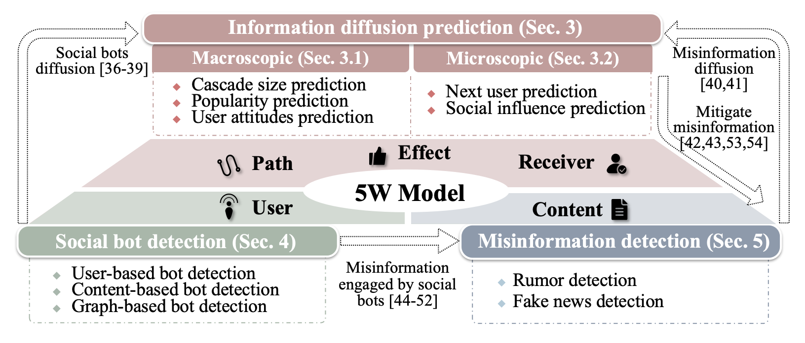
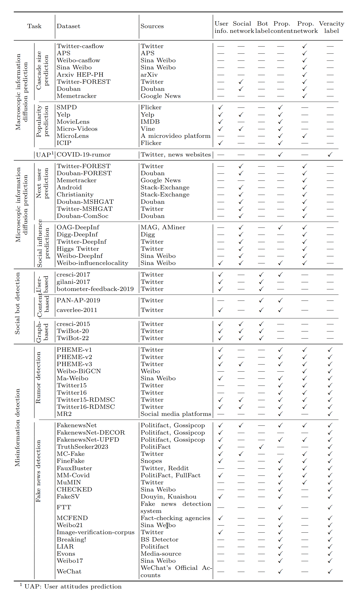

# Datasets-for-Information-Diffusion-Tasks
This is a repository of the datasets for the information diffusion tasks in our survey _A Survey of Datasets for Information Diffusion Tasks_. The paper can be downloaded [here](https://arxiv.org/abs/2407.05161). We will complete the detail information.


🚀 Welcome to follow and star! If you find any relevant materials that may be beneficial, feel free to contact us (fuxia_guo61@tju.edu.cn).


## 📌Table of Content
- [Datasets for Information Diffusion Tasks](#Datasets-for-Information-Diffusion-Tasks)
  - 🔥[Survey](#survey)
  <!-- - 🛖[Tasks](#tasks) -->
  - 📊[Datasets](#datasets)
  - [Citation](#citation)
  - [License](#license)


## Survey

We survey a systematic taxonomy of information diffusion tasks and datasets based on the "5W Model" framework. 

 - We categorize the information diffusion tasks into **ten subtasks** with definitions, datasets analysis and representative methodologies, from three main tasks of information diffusion prediction, social bot detection, and misinformation detection. 

 - We collect the publicly available dataset repository of information diffusion tasks with the available links and compare them based on **six attributes** affiliated to users and content: user information, social network, bot label, propagation content, propagation network, and veracity label. 

 - We discuss **the limitations and future directions** of current datasets and research topics to advance the future development of information diffusion.



Figure 1: Categorization of information diffusion tasks under the "5W Model" framework includes information diffusion prediction, social bot detection and misinformation detection, along with their respective subtasks and interrelationships.


### Six attributes


<br>
<div style="
display: inline-block;
color: #999;
padding: 2px;">
  Table 1: Notations of sSix attributes in the datasets.
</div>

- Attributes for user:

  - **User information:** Each user $u$ has their user information, including a basic user profile with a combination of semantic information (user description) and property information (numerical and categorical data), and optionally user historical information (posts and user engagements).
  - **Bot label:** $y^U$ denotes a social bot user (1) or a human user (0).
  - **Social network:** Among the user nodes set $V^U$, static relationships are denoted as the edges set $E^a$, such as follower/followee relationships, friendships, and co-authorships, which constitute the social network $G^a$.


- Attributes for content:
  - **Propagation content:** Each content $p$ published by users through media, such as posts, news, papers and comments, has its propagation content including texts/images/videos, tags, URLs, etc.
  - **Veracity label:** $y^P$ denotes false information (1) or true information (0). In rumor detection, this label typically indicates rumor ($R$) or non-rumor ($N$), and can also specify non-rumor ($N$), true rumor ($T$), false rumor ($F$), or unverified rumor ($U$).
  - **Propagation network:** Within a propagation content, dynamic relationships revealing propagation paths are generated by user engagement behaviors among content or user nodes $V=\{V^U, V^P\}$, denoted as the edges set $E^b$, which constitute the propagation network $G^b$.


NB: Propagation network edges $E^b$ can be further divided into the following three types based on whether nodes represent users or contents in different tasks.

  1. For user-to-user interactions in information diffusion prediction, the edges $E^{b1}$ represent the interaction relationships (click/like/repost/comment/citation) between two users $u \in V^U$ who publish the propagation content.

  2. For content-to-content interactions in rumor detection, the edges $E^{b2}$ represent the interaction relationships (repost/comment/citation) between a post $p \in V^P$ and its repost/comment or between two reposts/comments.

  3. For content-to-user interactions in fake news detection, the edges $E^{b3}$ represent the engagement relationships (click/like/repost/comment) between a news item $p \in V^P$ and its engagement elements such as users or between two engagement elements.


### Comparison of datasets
In terms of the classification of tasks and the six attributes of data, we collect sixty-six publicly available datasets used in current works for each subtask, as shown in Table 2. Additionally, the available URLs for these datasets are provided in Table 3.



<div style="
display: inline-block;
color: #999;
padding: 2px;">
  Table 2: Datasets comparison for each subtask: user information, social network, bot label,
propagation content, propagation network and veracity label.
</div>

<br>

<br>
<div style="
display: inline-block;
color: #999;
padding: 2px;">
  Table 3: The URLs of datasets for each subtask.
</div>

<!-- 
## Tasks


```
Format:
- **Task name**
  - Definition: 
  - Metrics: 
  - Latest Paper: [paper]()
  - Perference
```


The classification of information diffusion tasks is shown below.


#### Macroscopic Diffusion Prediction

<details open>
<summary>Cascade Size Prediction</summary>
<br>

- **Task name**
  - Definition: 
  - Metrics: 
  - Latest Paper: [paper]()
  - Perference


</details>


<details open>
<summary>User Attitudes Prediction</summary>
<br>

</details>


<details open>
<summary>Popularity Prediction</summary>
<br>

<br>
</details>


#### Microscopic Diffusion Prediction

<details open>
    <summary>Next User Prediction</summary>
<br>


<br>
</details>


### Social Bot Detection
<details open>
    <summary>Feature-based Bot Detection</summary>
<br>

<br>
</details>


<details open>
    <summary>Text-based Bot Detection</summary>
<br>

<br>
</details>


<details open>
    <summary>Graph-based Bot Detection</summary>
<br>

<br>
</details>


### Misinformation Detection

<details open>
    <summary>Rumor Detection</summary>
<br>


<br>
</details>


<details open>
    <summary> Fake News Detection</summary>
<br>

<br>
</details> -->

## Datasets
<!-- <details open>
<summary>Toggle</summary> -->
 
```
Format:
- **Dataset name**
  - Source platforms of the dataset.
  - Click to download the dataset.
  - Paper: Source paper of the dataset.
  - Time horizon (if any)

```

### Information Diffusion Prediction

#### Macroscopic Diffusion Prediction

<details open>
<summary>Cascade Size Prediction</summary>
<br>

- **Twitter-casflow**
  - Sources: Twitter
  - [Download the dataset.](https://github.com/Xovee/casflow) 
  - Paper: [Xu, X., Zhou, F., Zhang, K., Liu, S., & Trajcevski, G. (2023). CasFlow: Exploring Hierarchical Structures and Propagation Uncertainty for Cascade Prediction. IEEE Transactions on Knowledge and Data Engineering, 35(4), 3484–3499](https://doi.org/10.1109/TKDE.2021.3126475)
  - Time horizon: 2012.3 ~ 2012.4

- **APS**
  - Sources: American Physical Society
  - [Download the dataset.](https://github.com/Xovee/casflow) 
  - Paper: [Xu, X., Zhou, F., Zhang, K., Liu, S., & Trajcevski, G. (2023). CasFlow: Exploring Hierarchical Structures and Propagation Uncertainty for Cascade Prediction. IEEE Transactions on Knowledge and Data Engineering, 35(4), 3484–3499](https://doi.org/10.1109/TKDE.2021.3126475)
  - Time horizon: 1893 ~ 2009

- **Weibo-casflow**
  - Sources: Sina Weibo
  - [Download the dataset.](https://github.com/Xovee/casflow) 
  - Paper: [Xu, X., Zhou, F., Zhang, K., Liu, S., & Trajcevski, G. (2023). CasFlow: Exploring Hierarchical Structures and Propagation Uncertainty for Cascade Prediction. IEEE Transactions on Knowledge and Data Engineering, 35(4), 3484–3499](https://doi.org/10.1109/TKDE.2021.3126475)

- **Sina-Weibo-DeepHawkes**
  - Sources: Sina Weibo
  - [Download the dataset.](https://github.com/CaoQi92/DeepHawkes) 
  - Paper: [Cao, Q., Shen, H., Cen, K., Ouyang, W., & Cheng, X. (2017). DeepHawkes: Bridging the Gap between Prediction and Understanding of Information Cascades. Proceedings of the 2017 ACM on Conference on Information and Knowledge Management, 1149–1158.](https://doi.org/10.1145/3132847.3132973)
  - Time horizon: 2016.6

- **HEP-PH**
  - Sources: arXiv
  - [Download the dataset.](http://snap.stanford.edu/data/cit-HepPh.html)
  - Paper: [Jure Leskovec, Jon Kleinberg, and Christos Faloutsos. 2005. Graphs over time: densification laws, shrinking diameters and possible explanations. In Proceedings of the eleventh ACM SIGKDD international conference on Knowledge discovery in data mining (KDD '05). Association for Computing Machinery, 177–187.](https://doi.org/10.1145/1081870.1081893)
  - Time horizon: 1993.1 ~ 2003.4

- **Twitter-FOREST**
  - Sources: Twitter
  - [Download the dataset.](https://github.com/albertyang33/FOREST/tree/master/data)
  - Paper: [Yang, C., Tang, J., Sun, M., Cui, G., & Liu, Z. (2019). Multi-scale Information Diffusion Prediction with Reinforced Recurrent Networks. Proceedings of the Twenty-Eighth International Joint Conference on Artificial Intelligence, 4033–4039. ](https://doi.org/10.24963/ijcai.2019/560)
  - Time horizon: 2010.10

- **Douban-FOREST**
  - Sources: Douban
  - [Download the dataset.](https://github.com/albertyang33/FOREST/tree/master/data)
  - Paper: [Yang, C., Tang, J., Sun, M., Cui, G., & Liu, Z. (2019). Multi-scale Information Diffusion Prediction with Reinforced Recurrent Networks. Proceedings of the Twenty-Eighth International Joint Conference on Artificial Intelligence, 4033–4039. ](https://doi.org/10.24963/ijcai.2019/560)

- **Memetracker**
  - Sources: Google News
  - [Download the dataset.](https://github.com/albertyang33/FOREST/tree/master/data)
  - Paper: [Yang, C., Tang, J., Sun, M., Cui, G., & Liu, Z. (2019). Multi-scale Information Diffusion Prediction with Reinforced Recurrent Networks. Proceedings of the Twenty-Eighth International Joint Conference on Artificial Intelligence, 4033–4039.](https://doi.org/10.24963/ijcai.2019/560)
  - Time horizon: 2008.8 ~ 2008.10

</details>

<details open>
<summary>Popularity Prediction</summary>
<br>

- **SMPD**
  - Sources: Flickr
  - [Download the dataset.](https://smp-challenge.com/download.html)
  - Paper: [Wu, B., Cheng, W.-H., Liu, P., Liu, B., Zeng, Z., & Luo, J. (2019). SMP Challenge: An Overview of Social Media Prediction Challenge 2019. Proceedings of the 27th ACM International Conference on Multimedia, 2667–2671.](https://doi.org/10.1145/3343031.3356084)
  - Time horizon: 2015.3 ~ 2016.7

- **Yelp**
  - Sources: Yelp
  - [Download the dataset.](https://www.yelp.com/dataset/)
  - Paper: [Lin, A., Wang, J., Zhu, Z., & Caverlee, J. (2022). Quantifying and Mitigating Popularity Bias in Conversational Recommender Systems. Proceedings of the 31st ACM International Conference on Information & Knowledge Management, 1238–1247. ](https://doi.org/10.1145/3511808.3557423)

- **MovieLens**
  - Sources: IMDB 
  - [Download the dataset.](https://grouplens.org/datasets/movielens/)
  - Paper: [Garg, N., Sellathurai, M., Bhatia, V., Bharath, B. N., & Ratnarajah, T. (2020). Online Content Popularity Prediction and Learning in Wireless Edge Caching. IEEE Transactions on Communications, 68(2), 1087–1100.](https://doi.org/10.1109/TCOMM.2019.2956041)
  - Time horizon: 1995.1 ~ 2019.11


- **Micro-Videos**
  - Sources: Vine
  - [Download the dataset.](https://acmmm2016.wixsite.com/micro-videos/blank)
  - Paper: [Chen, J., Song, X., Nie, L., Wang, X., Zhang, H., & Chua, T.-S. (2016). Micro Tells Macro: Predicting the Popularity of Micro-Videos via a Transductive Model. Proceedings of the 24th ACM International Conference on Multimedia, 898–907.](https://doi.org/10.1145/2964284.2964314)
  - Time horizon: 2012.11 ~ 2013.7

- **MicroLens**
  - Sources: A micro-video platform
  - [Download the dataset.](https://github.com/westlake-repl/MicroLens)
  - Paper: [Ni, Y., Cheng, Y., Liu, X., Fu, J., Li, Y., He, X., Zhang, Y., & Yuan, F. (2023). A Content-Driven Micro-Video Recommendation Dataset at Scale (arXiv:2309.15379). arXiv. ](http://arxiv.org/abs/2309.15379)
  - Time horizon: 2022.6 ~ 2023.6

- **ICIP**
  - Sources: Flicker
  - [Download the dataset.](https://iplab.dmi.unict.it/popularitydataset/SIPD2020CHALLENGE/train/)
  - Paper: [Ortis, A., Farinella, G.M., Battiato, S. (2019). Prediction of Social Image Popularity Dynamics. In: Ricci, E., Rota Bulò, S., Snoek, C., Lanz, O., Messelodi, S., Sebe, N. (eds) Image Analysis and Processing – ICIAP 2019. ICIAP 2019. Lecture Notes in Computer Science(), vol 11752. Springer, Cham.](https://doi.org/10.1007/978-3-030-30645-8_52)

<br>
</details>


<details open>
<summary>User Attitudes Prediction</summary>
<br>

- **COVID-19-rumor**
  - Sources: Twitter, news websites
  - [Download the dataset.](https://github.com/MickeysClubhouse/COVID-19-rumor-dataset)
  - Paper: [Cheng, M., Wang, S., Yan, X., Yang, T., Wang, W., Huang, Z., Xiao, X., Nazarian, S., & Bogdan, P. (2021). A COVID-19 Rumor Dataset. Frontiers in Psychology, 12, 644801.](https://doi.org/10.3389/fpsyg.2021.644801)
  - Time horizon: 2018 ~ 2020

</details>


#### Microscopic Diffusion Prediction

<details open>
<summary>Next User Prediction</summary>
<br>

- **Twitter-FOREST**

  - Sources: Twitter
  - [Download the dataset.](https://github.com/albertyang33/FOREST/tree/master/data)
  - Paper: [Yang, C., Tang, J., Sun, M., Cui, G., & Liu, Z. (2019). Multi-scale Information Diffusion Prediction with Reinforced Recurrent Networks. Proceedings of the Twenty-Eighth International Joint Conference on Artificial Intelligence, 4033–4039. ](https://doi.org/10.24963/ijcai.2019/560)
  - Time horizon: 2010.10

- **Douban-FOREST**
  - Sources: Douban
  - [Download the dataset.](https://github.com/albertyang33/FOREST/tree/master/data)
  - Paper: [Yang, C., Tang, J., Sun, M., Cui, G., & Liu, Z. (2019). Multi-scale Information Diffusion Prediction with Reinforced Recurrent Networks. Proceedings of the Twenty-Eighth International Joint Conference on Artificial Intelligence, 4033–4039. ](https://doi.org/10.24963/ijcai.2019/560)

- **Memetracker**
  - Sources: Google News
  - [Download the dataset.](https://github.com/albertyang33/FOREST/tree/master/data)
  - Paper: [Yang, C., Tang, J., Sun, M., Cui, G., & Liu, Z. (2019). Multi-scale Information Diffusion Prediction with Reinforced Recurrent Networks. Proceedings of the Twenty-Eighth International Joint Conference on Artificial Intelligence, 4033–4039. ](https://doi.org/10.24963/ijcai.2019/560)
  - Time horizon: 2008.8 ~ 2008.10

- **Android**
  - Sources: Stack-Exchange
  - [Download the dataset.](https://github.com/slingling/MS-HGAT)
  - Paper: [Sun, L., Rao, Y., Zhang, X., Lan, Y., & Yu, S. (2022). MS-HGAT: Memory-Enhanced Sequential Hypergraph Attention Network for Information Diffusion Prediction. Proceedings of the AAAI Conference on Artificial Intelligence, 36(4), 4156–4164.](https://doi.org/10.1609/aaai.v36i4.20334)

- **Christianity**
  - Sources: Stack-Exchange
  - [Download the dataset.](https://github.com/slingling/MS-HGAT)
  - Paper: [Sun, L., Rao, Y., Zhang, X., Lan, Y., & Yu, S. (2022). MS-HGAT: Memory-Enhanced Sequential Hypergraph Attention Network for Information Diffusion Prediction. Proceedings of the AAAI Conference on Artificial Intelligence, 36(4), 4156–4164.](https://doi.org/10.1609/aaai.v36i4.20334)

- **Douban-MSHGAT**
  - Sources: Douban
  - [Download the dataset.](https://github.com/slingling/MS-HGAT)
  - Paper: [Sun, L., Rao, Y., Zhang, X., Lan, Y., & Yu, S. (2022). MS-HGAT: Memory-Enhanced Sequential Hypergraph Attention Network for Information Diffusion Prediction. Proceedings of the AAAI Conference on Artificial Intelligence, 36(4), 4156–4164.](https://doi.org/10.1609/aaai.v36i4.20334).

- **Twitter-MSHGAT**
  - Sources: Twitter
  - [Download the dataset.](https://github.com/slingling/MS-HGAT)
  - Paper: [Sun, L., Rao, Y., Zhang, X., Lan, Y., & Yu, S. (2022). MS-HGAT: Memory-Enhanced Sequential Hypergraph Attention Network for Information Diffusion Prediction. Proceedings of the AAAI Conference on Artificial Intelligence, 36(4), 4156–4164.](https://doi.org/10.1609/aaai.v36i4.20334)

- **Douban-ComSoc**
  - Sources: Douban
  - [Download the dataset.](http://www.cse.ust.hk/TL/dataset/Douban-50000.zip)
  - Paper: [Erheng Zhong, Wei Fan, Junwei Wang, Lei Xiao, and Yong Li. (2012). ComSoc: adaptive transfer of user behaviors over composite social network. In Proceedings of the 18th ACM SIGKDD international conference on Knowledge discovery and data mining (KDD '12). Association for Computing Machinery, New York, NY, USA, 696–704.](https://doi.org/10.1145/2339530.2339641)


<br>
</details>

<details open>
<summary>Social Influence Prediction</summary>
<br>


- **OAG-DeepInf**
  - Sources: Microsoft Academic Graph, AMiner
  - [Download the dataset.](https://github.com/xptree/DeepInf)
  - Paper: [Qiu, J., Tang, J., Ma, H., Dong, Y., Wang, K., & Tang, J. (2018). DeepInf: Social Influence Prediction with Deep Learning. Proceedings of the 24th ACM SIGKDD International Conference on Knowledge Discovery & Data Mining, 2110–2119. ](https://doi.org/10.1145/3219819.3220077)
  - Time horizon: 2018.11 ~ 2019.1

- **Digg-DeepInf**
  - Sources: Digg
  - [Download the dataset.](https://github.com/xptree/DeepInf)
  - Paper: [Qiu, J., Tang, J., Ma, H., Dong, Y., Wang, K., & Tang, J. (2018). DeepInf: Social Influence Prediction with Deep Learning. Proceedings of the 24th ACM SIGKDD International Conference on Knowledge Discovery & Data Mining, 2110–2119. ](https://doi.org/10.1145/3219819.3220077)
  - Time horizon: 2009.6 ~ 2009.7

- **Twitter-DeepInf**
  - Sources: Twitter
  - [Download the dataset.](https://github.com/xptree/DeepInf)
  - Paper: [Qiu, J., Tang, J., Ma, H., Dong, Y., Wang, K., & Tang, J. (2018). DeepInf: Social Influence Prediction with Deep Learning. Proceedings of the 24th ACM SIGKDD International Conference on Knowledge Discovery & Data Mining, 2110–2119. ](https://doi.org/10.1145/3219819.3220077)

- **Higgs Twitter**
  - Sources: Twitter
  - [Download the dataset.](https://snap.stanford.edu/data/higgs-twitter.html)
  - Paper: [De Domenico, M., Lima, A., Mougel, P., & Musolesi, M. (2013). The Anatomy of a Scientific Rumor. Scientific Reports, 3(1), 2980. ](https://doi.org/10.1038/srep02980)
  - Time horizon: 2012.6 ~ 2012.7

- **Weibo-DeepInf**
  - Sources: Sina Weibo
  - [Download the dataset.](https://github.com/xptree/DeepInf)
  - Paper: [Qiu, J., Tang, J., Ma, H., Dong, Y., Wang, K., & Tang, J. (2018). DeepInf: Social Influence Prediction with Deep Learning. Proceedings of the 24th ACM SIGKDD International Conference on Knowledge Discovery & Data Mining, 2110–2119. ](https://doi.org/10.1145/3219819.3220077)

- **Weibo-influencelocality**
  - Sources: Sina Weibo
  - [Download the dataset.](http://www.aminer.cn/influencelocality)
  - Paper: [Zhang, J., Liu, B., Tang, J., Chen, T., & Li, J. (2013, June). Social influence locality for modeling retweeting behaviors. In Twenty-third international joint conference on artificial intelligence.](https://dl.acm.org/doi/10.5555/2540128.2540526)
  - Time horizon: 2012.7 ~ 2012.10

<br>
</details>


### Social Bot Detection
<details open>
    <summary>User-based Bot Detection</summary>
<br>

- **cresci-2017**
  - Sources: Twitter
  - [Download the dataset.](https://botometer.osome.iu.edu/bot-repository/datasets.html)
  - Paper: [Cresci, S., Di Pietro, R., Petrocchi, M., Spognardi, A., & Tesconi, M. (2017). The paradigm-shift of social spambots: Evidence, theories, and tools for the arms race. Proceedings of the 26th International Conference on World Wide Web Companion - WWW ’17 Companion, 963–972. ](https://doi.org/10.1145/3041021.3055135)
  - Time horizon: 2015 ~ 2017

- **gilani-2017**
  - Sources: Twitter
  - [Download the dataset.](https://botometer.osome.iu.edu/bot-repository/datasets.html)
  - Paper: [Gilani, Z., Farahbakhsh, R., Tyson, G., Wang, L., & Crowcroft, J. (2017, July). Of bots and humans (on twitter). In Proceedings of the 2017 IEEE/ACM International Conference on Advances in Social Networks Analysis and Mining 2017 (pp. 349-354).](https://doi.org/10.1145/3110025.3110090)

- **botometer-feedback-2019**
  - Sources: Twitter
  - [Download the dataset.](https://botometer.osome.iu.edu/bot-repository/datasets.html)
  - Paper: [Yang, K., Varol, O., Davis, C. A., Ferrara, E., Flammini, A., & Menczer, F. (2019). Arming the public with artificial intelligence to counter social bots. Human Behavior and Emerging Technologies, 1(1), 48–61. ](https://doi.org/10.1002/hbe2.115)


<br>
</details>


<details open>
    <summary>Content-based Bot Detection</summary>
<br>

- **PAN-AP-2019**
  - Sources: Twitter
  - [Download the dataset.](https://pan.webis.de/clef19/pan19-web/author-profiling.html)
  - Paper: [Rangel, F., & Rosso, P. (2019). Overview of the 7th author profiling task at PAN 2019: bots and gender profiling in twitter. Working notes papers of the CLEF 2019 evaluation labs, 2380, 1-7.](https://downloads.webis.de/pan/publications/papers/rangel_2019.pdf)

- **caverlee-2011**
  - Sources: Twitter
  - [Download the dataset.](https://botometer.osome.iu.edu/bot-repository/datasets.html)
  - Paper: [Lee, K., Eoff, B., & Caverlee, J. (2021). Seven Months with the Devils: A Long-Term Study of Content Polluters on Twitter. Proceedings of the International AAAI Conference on Web and Social Media, 5(1), 185–192. ](https://doi.org/10.1609/icwsm.v5i1.14106)
  - Time horizon: 2009.12 ~ 2010.8

<br>
</details>


<details open>
    <summary>Graph-based Bot Detection</summary>
<br>

- **cresci-2015**
  - Sources: Twitter
  - [Download the dataset.](https://botometer.osome.iu.edu/bot-repository/datasets.html)
  - Paper: [Cresci, S., Di Pietro, R., Petrocchi, M., Spognardi, A., & Tesconi, M. (2015). Fame for sale: Efficient detection of fake Twitter followers. Decision Support Systems, 80, 56–71. ](https://doi.org/10.1016/j.dss.2015.09.003)

- **TwiBot-20**
  - Sources: Twitter
  - [Download the dataset.](https://github.com/BunsenFeng/TwiBot-20)
  - Paper: [Feng, S., Wan, H., Wang, N., Li, J., & Luo, M. (2021). TwiBot-20: A Comprehensive Twitter Bot Detection Benchmark. Proceedings of the 30th ACM International Conference on Information & Knowledge Management, 4485–4494. ](https://doi.org/10.1145/3459637.3482019)
  - Time horizon: 2020.7 ~ 2020.9

- **TwiBot-22**
  - Sources: Twitter
  - [Download the dataset.](https://drive.google.com/drive/folders/1YwiOUwtl8pCd2GD97Q_WEzwEUtSPoxFs?usp=sharing)
  - Paper: [Feng, S., Tan, Z., Wan, H., Wang, N., Chen, Z., Zhang, B., ... & Luo, M. (2022). Twibot-22: Towards graph-based twitter bot detection. Advances in Neural Information Processing Systems, 35, 35254-35269.](https://proceedings.neurips.cc/paper_files/paper/2022/file/e4fd610b1d77699a02df07ae97de992a-Paper-Datasets_and_Benchmarks.pdf)

<br>
</details>


### Misinformation Detection

<details open>
    <summary>Rumor Detection</summary>
<br>

- **PHEME-v1**
  - Sources: Twitter
  - [Download the dataset.](https://figshare.com/articles/dataset/PHEME_dataset_of_rumours_and_—n-rumours/4010619)
  - Paper: [Zubiaga, A., Liakata, M., & Procter, R. (2016). Learning Reporting Dynamics during Breaking News for Rumour Detection in Social Media (arXiv:1610.07363). arXiv. ](http://arxiv.org/abs/1610.07363)
  - Time horizon: 2014-2015

- **PHEME-v2**
  - Sources: Twitter
  - [Download the dataset.](https://figshare.com/articles/dataset/PHEME_dataset_for_Rumour_Detection_and_Veracity_Classification/6392078)
  - Paper: [Kochkina, E., Liakata, M., & Zubiaga, A. (2018). All-in-one: Multi-task Learning for Rumour Verification (arXiv:1806.03713). arXiv. ](http://arxiv.org/abs/1806.03713)

- **PHEME-v3**
  - Sources: Twitter
  - [Download the dataset.](https://www.sciencedirect.com/science/article/abs/pii/S0020025523006680)
  - Paper: [Zheng, P., Huang, Z., Dou, Y., & Yan, Y. (2023). Rumor detection on social media through mining the social circles with high homogeneity. Information Sciences, 642, 119083. ](https://doi.org/10.1016/j.ins.2023.119083)

- **Weibo-BiGCN**
  - Sources: Sina Weibo
  - [Download the dataset.](https://github.com/TianBian95/BiGCN)
  - Paper: [Bian, T., Xiao, X., Xu, T., Zhao, P., Huang, W., Rong, Y., & Huang, J. (2020, April). Rumor detection on social media with bi-directional graph convolutional networks. In Proceedings of the AAAI conference on artificial intelligence (Vol. 34, No. 01, pp. 549-556).](https://doi.org/10.1609/aaai.v34i01.5393)
  
- **Ma-Weibo**
  - Sources: Sina Weibo
  - [Download the dataset.](https://www.dropbox.com/s/46r50ctrfa0ur1o/rumdect.zip?dl=0)
  - Paper: [Jing Ma, Wei Gao, Prasenjit Mitra, Sejeong Kwon, Bernard J. Jansen, Kam-Fai Wong, and Meeyoung Cha. (2016). Detecting rumors from microblogs with recurrent neural networks. In Proceedings of the Twenty-Fifth International Joint Conference on Artificial Intelligence (IJCAI'16). AAAI Press, 3818–3824.](https://dl.acm.org/doi/10.5555/3061053.3061153)
  - Time horizon: 2015.3 ~ 2015.12

- **Twitter15**
  - Sources: Twitter
  - [Download the dataset.](https://www.dropbox.com/s/7ewzdrbelpmrnxu/rumdetect2017.zip?dl=0)
  - Paper: [Ma, J., Gao, W., & Wong, K.-F. (2017). Detect Rumors in Microblog Posts Using Propagation Structure via Kernel Learning. Proceedings of the 55th Annual Meeting of the Association for          Computational Linguistics (Volume 1: Long Papers), 708–717. ](https://doi.org/10.18653/v1/P17-1066)
  - Time horizon: 2015.3

- **Twitter16**
  - Sources: Twitter
  - [Download the dataset.](https://www.dropbox.com/s/7ewzdrbelpmrnxu/rumdetect2017.zip?dl=0)
  - Paper: [Ma, J., Gao, W., & Wong, K.-F. (2017). Detect Rumors in Microblog Posts Using Propagation Structure via Kernel Learning. Proceedings of the 55th Annual Meeting of the Association for Computational Linguistics (Volume 1: Long Papers), 708–717. ](https://doi.org/10.18653/v1/P17-1066)
  - Time horizon: 2015.3 ~ 2015.12

- **Twitter15-RDMSC**
  - Sources: Twitter
  - [Download the dataset.](https://github.com/Coder-HenryZa/RDMSC?tab=readme-ov-file)
  - Paper: [Zheng, P., Huang, Z., Dou, Y., & Yan, Y. (2023). Rumor detection on social media through mining the social circles with high homogeneity. Information Sciences, 642, 119083. ](https://doi.org/10.1016/j.ins.2023.119083)

- **Twitter16-RDMSC**
  - Sources: Twitter
  - [Download the dataset.](https://github.com/Coder-HenryZa/RDMSC?tab=readme-ov-file)
  - Paper: [Zheng, P., Huang, Z., Dou, Y., & Yan, Y. (2023). Rumor detection on social media through mining the social circles with high homogeneity. Information Sciences, 642, 119083. ](https://doi.org/10.1016/j.ins.2023.119083)

- **MR2**
  - Sources: Social media platforms
  - [Download the dataset.](https://gitcode.com/THU-BPM/MR2/overview)
  - Paper: [Hu, X., Guo, Z., Chen, J., Wen, L., & Yu, P. S. (2023). MR2: A Benchmark for Multimodal Retrieval-Augmented Rumor Detection in Social Media. Proceedings of the 46th International ACM SIGIR Conference on Research and Development in Information Retrieval, 2901–2912. ](https://doi.org/10.1145/3539618.3591896)

<br>
</details>


<details open>
    <summary> Fake News Detection</summary>
<br>

- **FakenewsNet**
  - Sources: Politifact, Gossipcop
  - [Download the dataset.](https://github.com/KaiDMML/FakeNewsNet)
  - Paper: [Shu, K., Mahudeswaran, D., Wang, S., Lee, D., & Liu, H. (2020). Fakenewsnet: A data repository with news content, social context, and spatiotemporal information for studying fake news on social media. Big data, 8(3), 171-188.](https://doi.org/10.1089/big.2020.0062)

- **FakeNewsNet-DECOR**
  - Sources: Politifact, Gossipcop
  - [Download the dataset.](https://github.com/jiayingwu19/DECOR)
  - Paper: [Wu, J., & Hooi, B. (2023). DECOR: Degree-Corrected Social Graph Refinement for Fake News Detection. Proceedings of the 29th ACM SIGKDD Conference on Knowledge Discovery and Data Mining, 2582–2593. ](https://doi.org/10.1145/3580305.3599298)

- **FakeNewsNet-UPFD**
  - Sources: Politifact, Gossipcop
  - [Download the dataset.](https://github.com/safe-graph/GNN-FakeNews)
  - Paper: [Dou, Y., Shu, K., Xia, C., Yu, P. S., & Sun, L. (2021, July). User preference-aware fake news detection. In Proceedings of the 44th international ACM SIGIR conference on research and development in information retrieval (pp. 2051-2055).](https://doi.org/10.1145/3404835.3462990)

- **TruthSeeker2023**
  - Sources: PolitiFact
  - [Download the dataset.](https://www.unb.ca/cic/datasets/truthseeker-2023.html)
  - Paper: [Dadkhah, S., Zhang, X., Weismann, A. G., Firouzi, A., & Ghorbani, A. A. (2023). The Largest Social Media Ground-Truth Dataset for Real/Fake Content: TruthSeeker. IEEE Transactions on Computational Social Systems, 1–15. ](https://doi.org/10.1109/TCSS.2023.3322303)
  - Time horizon: 2009 ~ 2022

- **MC-Fake**
  - Sources: Twitter
  - [Download the dataset.](https://github.com/qwerfdsaplking/MC-Fake)
  - Paper: [Min, E., Rong, Y., Bian, Y., Xu, T., Zhao, P., Huang, J., & Ananiadou, S. (2022). Divide-and-Conquer: Post-User Interaction Network for Fake News Detection on Social Media. Proceedings of the ACM Web Conference 2022, 1148–1158. ](https://doi.org/10.1145/3485447.3512163)

- **FineFake**
  - Sources: Snopes, Social Media (e.g. Twitter), Official News (e.g. CNN)
  - [Download the dataset.](https://github.com/Accuser907/FineFake) 
  - Paper: [Zhou, Z., Zhang, X., Zhang, L., Liu, J., Zhang, X., & Li, C. (2024). FineFake: A Knowledge-Enriched Dataset for Fine-Grained Multi-Domain Fake News Detecction. arXiv preprint arXiv:2404.01336.](https://arxiv.org/abs/2404.01336)

- **FauxBuster**
  - Sources: Twitter, Reddit
  - [Download the dataset.](https://ieeexplore.ieee.org/abstract/document/8622344) 
  - Paper: [Zhang, D. Y., Shang, L., Geng, B., Lai, S., Li, K., Zhu, H., ... & Wang, D. (2018, December). Fauxbuster: A content-free fauxtography detector using social media comments. In 2018 IEEE international conference on big data (big data) (pp. 891-900). IEEE.](https://ieeexplore.ieee.org/abstract/document/8622344)
  - Time horizon: 2018.2

- **MM-Covid**
  - Sources: Fact-checking agencies like PolitiFact, FullFact
  - [Download the dataset.](https://github.com/bigheiniu/X-COVID) 
  - Paper: [Li, Y., Jiang, B., Shu, K., & Liu, H. (2020). MM-COVID: A Multilingual and Multimodal Data Repository for Combating COVID-19 Disinformation (arXiv:2011.04088). arXiv.](http://arxiv.org/abs/2011.04088)

- **MuMIN**
  - Sources: Twitter
  - [Download the dataset.](https://mumin-dataset.github.io/) 
  - Paper: [Nielsen, D. S., & McConville, R. (2022). MuMiN: A Large-Scale Multilingual Multimodal Fact-Checked Misinformation Social Network Dataset. Proceedings of the 45th International ACM SIGIR Conference on Research and Development in Information Retrieval, 3141–3153.](https://doi.org/10.1145/3477495.3531744)


- **CHECKED**
  - Sources: Sina Weibo
  - [Download the dataset.](https://github.com/cyang03/checked)
  - Paper: [Yang, C., Zhou, X., & Zafarani, R. (2021). CHECKED: Chinese COVID-19 fake news dataset. Social Network Analysis and Mining, 11(1), 58.](https://doi.org/10.1007/s13278-021-00766-8)
  - Time horizon: 2019.12 ~ 2020.8

- **FakeSV**
  - Sources: Douyin, Kuaishou
  - [Download the dataset.](https://github.com/ICTMCG/FakeSV)
  - Paper: [Qi, P., Bu, Y., Cao, J., Ji, W., Shui, R., Xiao, J., Wang, D., & Chua, T.-S. (2023). FakeSV: A Multimodal Benchmark with Rich Social Context for Fake News Detection on Short Video Platforms. Proceedings of the AAAI Conference on Artificial Intelligence, 37(12), 14444–14452. ](https://doi.org/10.1609/aaai.v37i12.26689)
  - Time horizon: 2019.1 ~ 2022.1

- **FTT**
  - Sources: A fake news detection system
  - [Download the dataset.](https://github.com/ICTMCG/FTT-ACL23)
  - Paper: [Hu, B., Sheng, Q., Cao, J., Zhu, Y., Wang, D., Wang, Z., & Jin, Z. (2023). Learn over Past, Evolve for Future: Forecasting Temporal Trends for Fake News Detection. Proceedings of the 61st Annual Meeting of the Association for Computational Linguistics (Volume 5: Industry Track), 116–125. ](https://doi.org/10.18653/v1/2023.acl-industry.13)
  - Time horizon: 2016.1 ~ 2020.12

- **MCFEND**
  - Sources: Fourteen fact-checking agencies
  - [Download the dataset.](https://github.com/Nicozwy/MCFEND_WWW/tree/main?tab=readme-ov-file)
  - Paper: [Li, Y., He, H., Bai, J., & Wen, D. (2024, May). MCFEND: a multi-source benchmark dataset for Chinese fake news detection. In Proceedings of the ACM on Web Conference 2024 (pp. 4018-4027).](https://doi.org/10.1145/3589334.3645385)
  - Time horizon: 2015.3 ~ 2023.3

- **Weibo21**
  - Sources: Sina Weibo
  - [Download the dataset.](https://github.com/kennqiang/mdfend-weibo21)
  - Paper: [Nan, Q., Cao, J., Zhu, Y., Wang, Y., & Li, J. (2021). MDFEND: Multi-domain Fake News Detection. Proceedings of the 30th ACM International Conference on Information & Knowledge Management, 3343–3347. ](https://doi.org/10.1145/3459637.3482139)
  - Time horizon: 2014.12 ~ 2021.3

- **Image-verification-corpus**
  - Sources: Twitter
  - [Download the dataset.](https://github.com/MKLab-ITI/image-verification-corpus)
  - Paper: [Boididou, C., Papadopoulos, S., Zampoglou, M., Apostolidis, L., Papadopoulou, O., & Kompatsiaris, Y. (2018). Detection and visualization of misleading content on Twitter. International Journal of Multimedia Information Retrieval, 7(1), 71-86.](https://doi.org/10.1007/s13735-017-0143-x)

- **Breaking!**
  - Sources: BS Detector
  - [Download the dataset.](https://github.com/architapathak/FakeNewsCorpus) 
  - Paper: [Pathak, A., & Srihari, R. (2019). BREAKING! Presenting Fake News Corpus for Automated Fact Checking. Proceedings of the 57th Annual Meeting of the Association for Computational Linguistics: Student Research Workshop, 357–362.](https://doi.org/10.18653/v1/P19-2050)
  - Time horizon: 2016.10 ~ 2016.11

- **LIAR**
  - Sources: Politifact
  - [Download the dataset.](https://www.cs.ucsb.edu/~william/data/liar_dataset.zip) 
  - Paper: [Wang, W. Y. (2017). " liar, liar pants on fire": A new benchmark dataset for fake news detection. arXiv preprint arXiv:1705.00648.](https://arxiv.org/abs/1705.00648)
  - Time horizon: 2007 ~ 2016

- **Evons**
  - Sources: Media-source
  - [Download the dataset.](https://github.com/krstovski/evons) 
  - Paper: [Krstovski, K., Ryu, A. S., & Kogut, B. (2022). Evons: A Dataset for Fake and Real News Virality Analysis and Prediction (arXiv:2209.08129). arXiv.](http://arxiv.org/abs/2209.08129)
  - Time horizon: 2016.1 ~ 2017.12

- **Weibo17**
  - Sources: Sina Weibo
  - [Download the dataset.](https://doi.org/10.1145/3123266.3123454) 
  - Paper: [Jin, Z., Cao, J., Guo, H., Zhang, Y., & Luo, J. (2017). Multimodal Fusion with Recurrent Neural Networks for Rumor Detection on Microblogs. Proceedings of the 25th ACM International Conference on Multimedia, 795–816.](https://doi.org/10.1145/3123266.3123454)
  - Time horizon: 2012.5 ~ 2016.1

<!-- 
- **name**
  - Sources: 
  - [Download the dataset.]()
  - Paper: [paper]()

- **name**
  - Sources: 
  - [Download the dataset.]()
  - Paper: [paper]()

- **name**
  - Sources: 
  - [Download the dataset.]()
  - Paper: [paper]()
 -->

<br>
</details>


## Citation
Our survey paper is ["A Survey of Datasets for Information Diffusion Tasks"](https://arxiv.org/abs/2407.05161) at arXiv, which includes more detailed discussions and we will continuously update it as well. **The latest version was updated on July 6, 2024.**
 
If you find our repo is helpful, please consider cite it.

```BibTeX
@misc{guo2024survey,
      title={A Survey of Datasets for Information Diffusion Tasks}, 
      author={Fuxia Guo and Xiaowen Wang and Yanwei Xie and Zehao Wang and Jingqiu Li and Lanjun Wang},
      year={2024},
      eprint={2407.05161},
      archivePrefix={arXiv},
      primaryClass={cs.SI},
      url={https://arxiv.org/abs/2407.05161}, 
}

```

## License

Datasets for Information Diffusion Tasks is released under the Apache 2.0 license.
